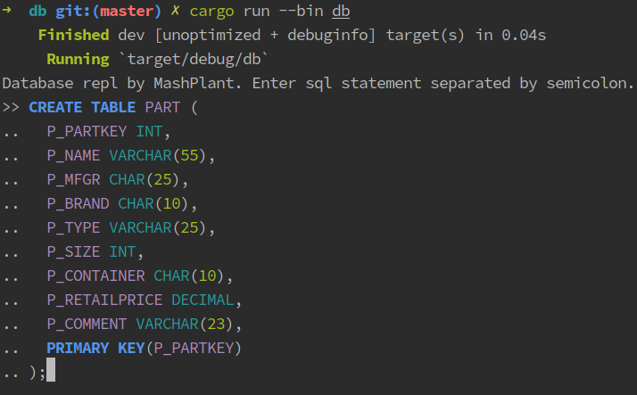
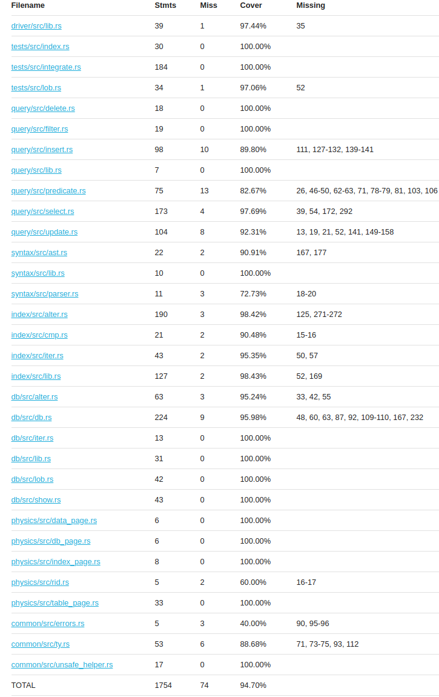
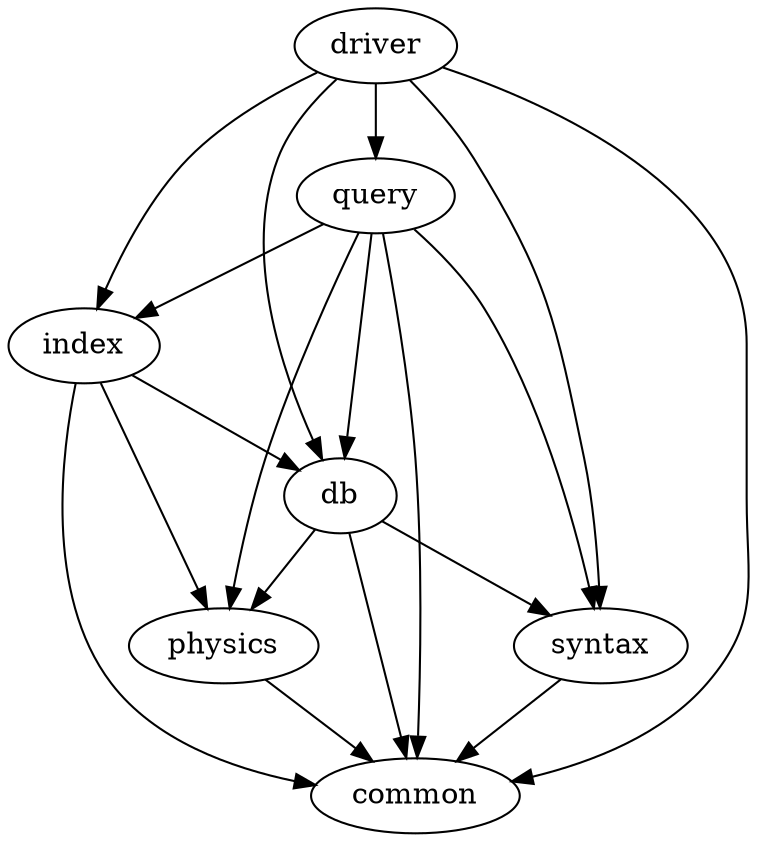

从零开始，用Rust实现的DBMS。

# 功能

- 基于B+树的查询优化
- 多表连接：理论上支持任意多表的连接(只要性能和空间允许)
- 聚集查询：支持`avg`，`sum`，`max`，`min`，`count`关键字，对`select`的结果进行聚集
- 模糊匹配：支持`like`关键字，通配符`%`和`_`，转义字符
- 日期数据类型
- `unique`约束，`check`约束
- `insert`支持指定要插入数据的列，`update`的`set`子句支持复杂的表达式
- 支持着色的REPL

# 编译和测试

要求nightly版本的rust编译器。在`rustc 1.54.0-nightly`上测试过，版本越新越好。

执行`cargo run --bin db --release`运行数据库REPL。

[tests](tests) crate中包含集成测试，其中建库耗时较长且其他测试依赖于它，所以需要提前单独执行：`cargo test -p tests create --release -- --ignored`，然后执行`cargo test -p tests --release`。

[makefile](makefile)用来进行代码覆盖率测试。工具要求：

- `cargo-tarpaulin` (`cargo install cargo-tarpaulin`)
- `pycobertura` (`pip install pycobertura`)
- `BROWSER`变量中指定的浏览器

执行`make`进行代码覆盖率测试。结果类似于：

# 项目结构

以Rust的crate为边界划分逻辑，crate间的依赖关系为：

- [common](common)：提供公用的函数和数据结构，例如错误处理的机制
- [physics](physics)：定义数据库各种页的数据结构
- [syntax](syntax)：将SQL语句解析为AST，基于我写的parser generator [lalr1](https://github.com/MashPlant/lalr1)
- [db](db)：定义数据库的核心接口，以及实现一些不需要用到索引的修改操作
- [index](index)：实现基于B+树的索引，以及实现一些需要用到索引的修改操作
- [query](query)：实现CRUD四种查询
- [driver](driver)：顶层接口和可执行文件

完整报告见[report.pdf](report/report.pdf)。